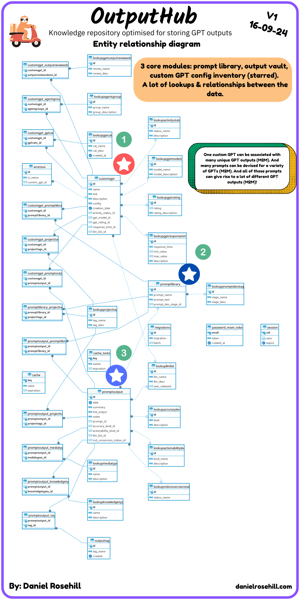
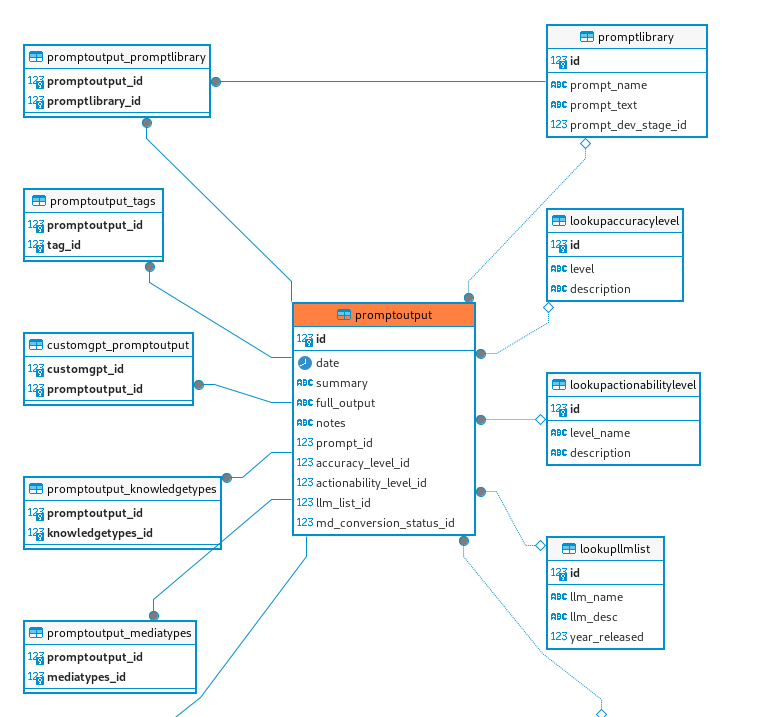
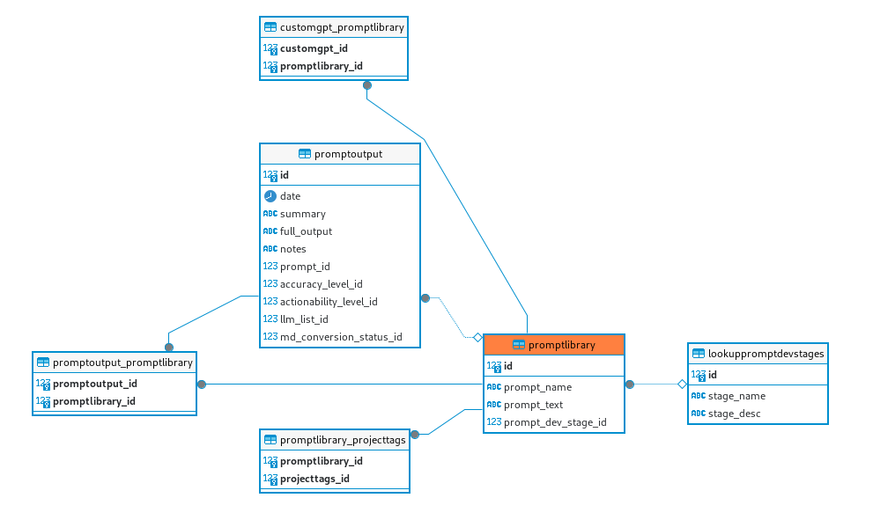

*Banner: A depiction of a sloth opening up a wooden chest containing GPTs. DALLE.*

---

#  Output Hub (Project Name)

## An "Output Management System" (storage, indexing, editing of textual LLM outputs)

*The "whys"*

**For everyone:**

- Because copying and pasting valuable LLM outputs into Google Docs isn't sustainable, scalable, or smart
- Because wherever you do your prompting and wherever you get those outputs, it doesn't make sense to store those outputs on a SaaS platform that makes no guarantees about safeguarding your data

**For business users:**

- Because as AI tools and humans begin to work in harmonious workflows, LLM outputs that are carefully reviewed and improved upon should be treated with the same importance as other business information and internal knowledge
- Because the native search and indexing capabilities of major LLM platforms are (currently) underdeveloped and as outputs scale into the hundreds and tens of thousands information retrieval and organisation become real concerns
- Because different LLMs serve different purposes but their outputs should be centralised
- Because storing a structured repository of outputs can cut down on unnecessary LLM runs
- Because aggregating outputs faciltates the creation of a central data repository that could later be used for data mining and insights - or offloaded to a data warehouse for second-pass LLM analysis

**For AI enthusiasts**

- Because effective prompt engineering requires associating prompts and outputs and simply storing an inventory of prompts isn't enough

---

## Now The Formal Description

A knowledge management tool optimised for the storage and retrieval of the outputs of large language models (LLMs) including GPTs - intended for both professional users of LLMs and individual users generating at scale and requiring robust output storage. 

Output Hub aims to provide a cohesive framework for managing LLM outputs to facilitate their refinement and development by humans. It is designed to ensure that useful textual LLM generations are retained, well-indexed, and accessible - in much the same way that traditional knowledge management tools have sought to manage knowledge. 

In addition to that, and in recognition of how LLM usage works, Output Hub (working name) also provides modules for recording prompts (ie, a prompt library) and for storing the configuration of custom LLM agents. 

A core focus of the design of Output Hub is using the power of relational database design to create deep linkages within the system. This, in turn, can yield further value. 

For example, by creating associations between custom LLM agents and their outputs, agent configurations can be improved iteratively. Other metadata elements have been added to reflect information that may be important in professional usage environments. An example of this is associating formal data retention policies with individual outputs. 

The framework outlined in this system describes a system designed to enable LLM outputs to receive proper attention and management in internal information systems. The data model and architecture are both works in progress and the precise fields and tables outlined here should be understood as merely illustrative of the broader concept.

---

## Screenshots

See `Screenshots.md` for some Screenshots of system modules as I develop them!

---

## Data Structure & Relationships

### A Simpler Model

### ERD - The Details

### Key system modules

 ----

### Listing Custom LLM Agents

### Custom GPT List View

### View & Edit Output

---

## Core Modules

### 1: Prompt Output Library

The core function of this module is to record and store for recall the output of LLM prompts that may have lasting value (for whatever purpose). 

The module can be written to and read from both programatically (via direct API integration with ChatGPT, for example) or via a web UI (for example, the user copies and pastes prompts and prompt outputs or perhaps uses some RPA tools to do this more efficiently.)

Over time, a rich and useful repository of information is developed. As prompt outputs are reviewed by humans, human-refined AI outputs can be stored in a separate database field (like `edited_output`).

### 2: Custom Agent Library

Just as engineered prompts are valuable assets for ongoing interactions with LLMs, customised LLMs (context and knowledge layered onto core models) have potentially significant business value.

The second module in Output Hub (working name) is a system for storing these configurations. Again, you could record custom GPTs created programatically or visually.

An important data relationship is that which is captured between **GPT outputs** and **custom GPTs**. By mapping outputs onto the GPTs they originated from (where those are custom GPTs and not the undifferentiated GPT models) custom GPT configurations can be evaluated for efficacy and refined iteratively. 

In a future iteration, these two datasets might even be compared by AI (that is to say, an AI could parse a custom GPT's outputs to identify configuration changes for the underlying GPT).

### 3: Prompt Library

My current architecture is like this:

- When prompt outputs are recorded, the prompts (their corresponding input) is recorded. 

This is a means of capturing prompts that are written casually on an ad-hoc basis. 

Prompt libraries are more typically used in the reverse order: to capture prompts that are drafted, carefully refined, and then used in production. This module captures those prompts too.

A work in progress? Figuring out the best way to make these two sides of the prompting journey connect as a unified dataset. The workflow I'm working towards: casual prompts are captured as draft "serious" prompts (in the library). They may be discarded or evaluated as prospective production prompts. 

---

## Key Data Relationships

| Relationship | Description | Why It Matters |
| --- | --- | -- | 
| Prompt outputs to tags | Prompt outputs have tags (M2M) | A useful basic system taxonomy for exploring prompt outputs at a later date by selecting for specific tags. |
| Prompt outputs to prompts | Every prompt output has at least one prompt. One prompt can generate many outputs | Correlate prompting (input) with output (output) |
| Custom GPTs to prompt outputs | A custom GPT is used to generate a prompt. Any GPT can be used to generate an infinite number of prompts. | Correlate custom GPT configurations with the prompt outputs that they generate |
| Prompts to custom GPTs | Prompts are used to generate outputs from custom GPTs | Identifying what kind of prompting strategy works best for a specific custom GPT | 

---

## Starter System Taxonomies

See the starter taxonomies and the `notes.md` in the folder.

---

## What Is An AI Output Management System Designed To Do?

Here's my thinking and definition: 

Even at a basic level of scale, leveraging LLMs *professionally* involves an evolving series of functions which will likely become more "standardised" as harnessing LLMs for business uses becomes more entrenched and established. 

While enterprise users may develop proprietary LLMs, many smaller businesses will access the technology through popular platforms like OpenAI's ChatGPT.

---

## Current Stack

See - `stack.md`

---

### Core Components Of An "Output Hub"

Whether users are using LLMs programatically or via GUI elements including a web UI, these activities are likely very important:

- **Creating an inventory of custom LLM agents and/or prompts**: Prompt engineering and custom LLM agents both offer distinct advantages and can be used well together. To avoid vendor-lock, no matter where custom LLMs are configured, it is prudent to maintain a careful inventory of them noting all their key parameters. 
- **Prompt evaulation and testing**: A/B testing prompts and putting them through formal evaluation frameworks. Version control systems are important to iteratively improve prompts used in production settings where generation-based expenditure provides a powerful incentive for generative AI teams to optimise the prompts used.
- **Prompt output capture**: Prompt output capture entails being rigorous about capturing LLM outputs whether they are generated via a script or in a browser tab. 

Although many tools target solely one aspect of this workflow, the data is inter-related. For example:

- A human wishes to achieve something with generative AI and writes the draft for a prompt. Potentially valuable business data has now been generated. 
- After iterative improvement (probably collaboratively in the business setting) the prompt might be considered ready for production use and entered into a prompt library. 
- That prompt will be used to generate discrete outputs. Those outputs and the prompt they are generated from are highly related datapoints that should be related formally in the data structure. The outputs can be leveraged to iteratively improve the underlying prompt. 

A true LLM Output Management System ("OMS") should incorporate all these related "modules" into one holistic system.

---

## Keywords

- LLMs
- GPTs
- Custom GPTs
- NocoDB

---

## Repository Components

`System.md`
- High level document describing the system
  
---

## Author

Daniel Rosehill  
(public at danielrosehill dot com)

## Licensing

This repository is licensed under CC-BY-4.0 (Attribution 4.0 International) 
[License](https://creativecommons.org/licenses/by/4.0/)
